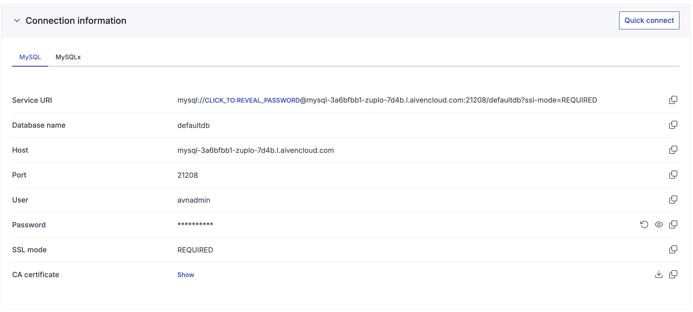
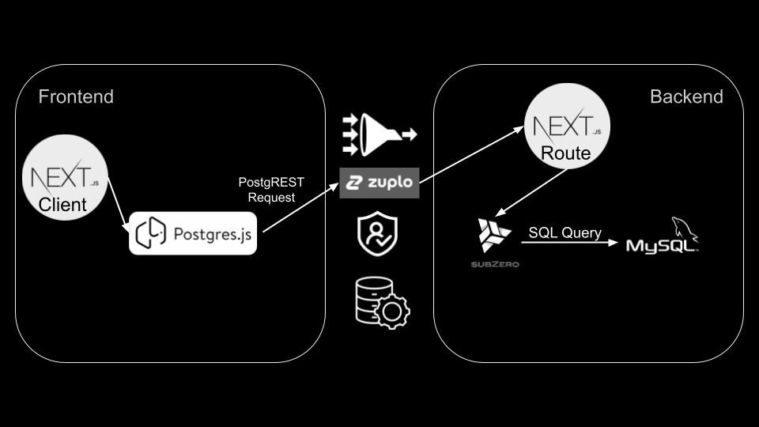

# MySQL PostgREST

Do you wish you could interact with your MySQL database via API/SDK like Supabase? Look no further! This project shows you exactly how to recreate the Supabase API and developer experience.

## Installation

This is just a template so you can clone this repository directly and run it yourself.

1. Create a hosted MySQL database (ex. using [Aiven's free tier](https://aiven.io/pricing?product=mysql)) and grab the connection parameters.



2. Create a table following [planetscale's quickstart](https://planetscale.com/docs/tutorials/planetscale-quick-start-guide)

```sql
CREATE TABLE products (
  id int NOT NULL AUTO_INCREMENT PRIMARY KEY,
  name varchar(255) NOT NULL,
  image_url varchar(255),
  category_id INT,
  KEY category_id_idx (category_id)
);
```

3. Create an `admin` role and grant it full access

```sql
CREATE ROLE 'admin'
GRANT ALL on app_db.* to 'admin'
```

4. Grant your user the admin role. For example:

```sql
GRANT 'admin' to 'avnadmin';
```

Alternatively you can use the included `permissions.json` file to determine access and roles.

5. Create a `.env` file at the root and set env vars from step 1

```
NEXT_PUBLIC_API_URL=# ex. "http://localhost:3000"
DATABASE_HOST=# ex. "aws.connect.psdb.cloud"
DATABASE_USERNAME=
DATABASE_PASSWORD=
DATABASE_PORT=
DATABASE_CA_CERTIFICATE=
```

6. Install and run

```bash
npm install
npm run dev
```

## How It Works



PostgREST requests are sent from the front-end to a catch-all route which invokes a serverless function. That function translates the request into a SQL query and executes it against your Neon database. The results are returned as a JSON.

NOTE: I wouldn't recommend actually performing SQL queries from your front-end - I bundled this together for demonstration purposes. You are essentially providing a door for malicious actors to interact with your database from your front-end. Instead, I would host the PostgREST API in a separate project (and protected behind a gateway), and call it from CRUD RESTful serverless functions on this project. Alternatively, I think you can implement stuff like row-level security and anon keys to make this method more secure, which is what Supabase does.

## Tools

I used the following tools:

1. NextJS Serverless Functions for easy Typescript setup + fast runtime (Cloudflare Workers will also work, but you won't be able to read files using node libs).
2. Vercel to simplify deployment (you can use Cloudflare pages too).
3. [`@supabase/postgrest-js`](https://www.npmjs.com/package/@supabase/postgrest-js) to construct queries using a Supabase-like SDK. This sends PostgREST requests to your serverless function.
4. [`@subzerocloud/rest`](https://www.npmjs.com/package/@subzerocloud/rest) to translate the PostgREST requests into Postgres queries.
5. [`mariadb`](https://www.npmjs.com/package/mariadb) for querying your MySQL database.
6. (optional) [Zuplo API Gateway](https://zuplo.com) to proxy your serverless function. Good place to add caching, rate limiting, DDOS/bot protection, etc so this doesn't blow up in production. You can find the gateway code [here](https://github.com/zuplo-samples/neon-postgrest-proxy).

Created with ❤️ by [Zuplo](https://zuplo.com).
